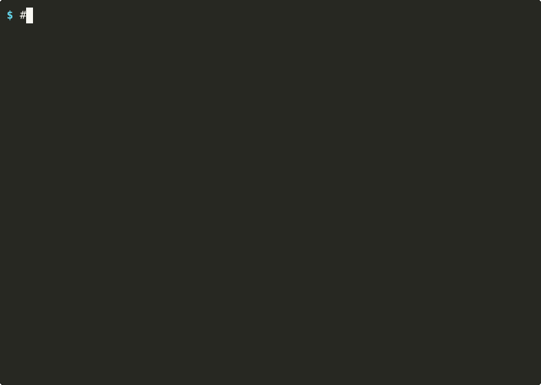
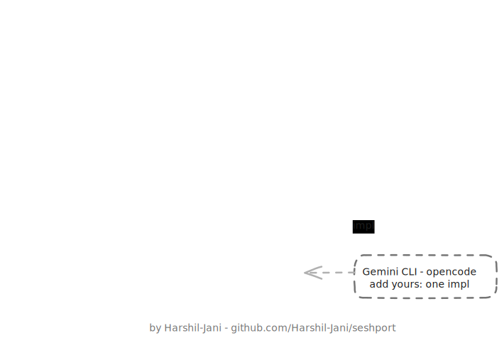

<div align="center">

# seshport

**Port your session between coding agents.**
Type `/seshport` inside Claude Code or Codex, open the other agent,
and `resume` the exact same conversation with full context included.

[](https://crates.io/crates/seshport)
[](https://www.npmjs.com/package/seshport)
[](https://pypi.org/project/seshport/)
[](https://github.com/Harshil-Jani/homebrew-tap)
[](https://github.com/Harshil-Jani/seshport/actions/workflows/ci.yml)
[](LICENSE)

[](#cli-usage)
[](https://github.com/Harshil-Jani/seshport/stargazers)

`npm i -g seshport` · `pip install seshport` · `cargo install seshport` · `brew install harshil-jani/tap/seshport`

By [Harshil-Jani](https://github.com/Harshil-Jani)

</div>

---

## Demo



A Codex session's haiku, recited by Claude Code after the port. A Claude Code session's
fizzbuzz, recalled by Codex. Real recording, synthetic sessions, nothing staged.

## Install

One line installs the binary **and** the `/seshport` slash command for both agents:

```bash
curl -fsSL https://raw.githubusercontent.com/Harshil-Jani/seshport/main/install.sh | sh
```

Or grab just the binary from wherever you live:

```bash
npm i -g seshport                        # Node
pip install seshport                     # Python
cargo install seshport                   # Rust
brew install harshil-jani/tap/seshport   # Homebrew
```

Then copy [`commands/`](commands/) into `~/.claude/commands/` and `~/.codex/prompts/`
for the `/seshport` slash command.

| Registry | Link |
|----------|------|
| npm | https://www.npmjs.com/package/seshport |
| PyPI | https://pypi.org/project/seshport/ |
| crates.io | https://crates.io/crates/seshport |
| Homebrew tap | https://github.com/Harshil-Jani/homebrew-tap |
| Prebuilt binaries (mac arm/x64, linux arm/x64, windows) | https://github.com/Harshil-Jani/seshport/releases |

## The easy way: `/seshport`

Never leave your agent. Mid-conversation, just type:

```
/seshport
```

- Inside **Claude Code** → replies with `codex resume <id>`
- Inside **Codex** → replies with `cd <project> && claude --resume <id>`

Open the other agent, paste, and continue the exact same conversation. Verified: a codeword
planted in a Claude Code session was recalled by Codex after a `/seshport` round-trip.

## CLI usage

The source tool is always auto-detected; name the target (or omit it when only one
target is possible).

```bash
seshport <session-id> <tool>   # port any session to any tool (claude | codex | grok)
seshport <session-id>          # auto: found in any tool, only one possible target
seshport <path.jsonl> <tool>   # format detected from file content
seshport claude codex          # newest Claude Code session -> Codex
seshport grok claude           # newest Grok Build session -> Claude Code
```

Each run prints the output path and the exact resume command:

```
$ seshport codex
/Users/you/.claude/projects/-your-project/1b2c3d4e-....jsonl
resume with:  cd /your/project && claude --resume 1b2c3d4e-...
```

Want to try without touching your real sessions? The demo transcripts from the GIF are in
[`demo/`](demo/):

```bash
seshport demo/codex-session.jsonl claude          # -> claude --resume <id>
seshport demo/claude-session.jsonl grok           # -> grok --resume <id>
seshport demo/grok-session/chat_history.jsonl codex   # -> codex resume <id>
```

## Architecture



The one-whiteboard version (forward it to your team lead). For the technical design, where
every agent is one `Tool` trait impl against a neutral `Transcript` (N tools cost 2·N
converters instead of N²), see [CONTRIBUTING.md](CONTRIBUTING.md). The whiteboard is editable:
open [`docs/architecture.excalidraw`](docs/architecture.excalidraw) at [excalidraw.com](https://excalidraw.com).

## How it works

- User and assistant messages transfer as-is into a neutral `Transcript`.
- Tool calls/results are flattened to readable text (`[tool call: Bash] ...`). Provider-specific
  API state (tool-call ids, encrypted reasoning) can't be replayed cross-provider, but the
  resumed agent gets the full story as context.
- Thinking/reasoning blocks are dropped (provider-internal).
- Codex output borrows `base_instructions` from your newest real rollout, since ChatGPT-auth Codex
  rejects sessions without the official instructions.
- Every import starts with an attribution message noting the source session and this tool.

## Add your editor (PRs welcome)

Every integration is one `Tool` impl (five methods) plus a demo fixture. See
[CONTRIBUTING.md](CONTRIBUTING.md) for the step-by-step guide, and
[PR #1](https://github.com/Harshil-Jani/seshport/pull/1) (Grok Build) for a worked example
you can copy.

## License

MIT © Harshil Jani
